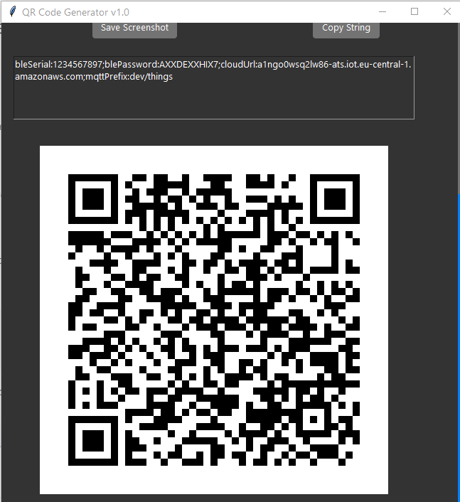

# QR Code Generator

## Overview

The QR Code Generator is a Python application that allows users to generate QR codes with various customization options. The application supports both dark and light themes and includes features such as generating QR codes from user inputs, uploading binary files, and converting keys to Base36 format.

## Architecture

The application is structured as follows:

- **main.py**: The main entry point for the application.
- **algorithms.py**: Contains the algorithms for calculating check digits.
- **qr_generator.py**: Handles the generation of QR codes.
- **utils.py**: Utility functions for saving screenshots and loading YAML files.
- **converters.py**: Functions for encoding and decoding Base36.
- **Azure-ttk-theme**: Directory containing the Azure theme files for the application.
- **requirements.txt**: Lists the dependencies required to run the application.

## Install Dependencies
**sh**

pip install -r requirements.txt

## Running the Application
To run the application, execute the following command:

**sh**

python main.py

## Generating QR Codes

1. Enter the required information in the form fields.
2. Click the "Generate QR Code" button to generate the QR code.
3. The generated QR code will be displayed in the application window.

## Saving QR Codes

Click the "Save Screenshot" button to save the QR code as an image file.

## Copying QR Code Strings

Click the "Copy String" button to copy the generated QR code string to the clipboard.

